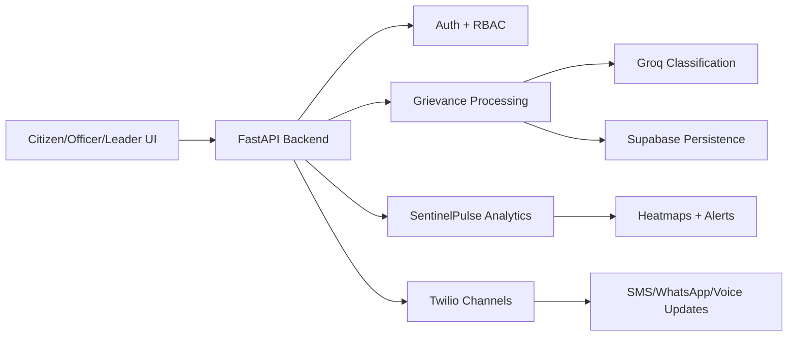

---
layout: cover
class: text-center
---

# PRAJA Platform
## Deep Architectural Overview

AI-powered Citizen Grievance & Constituency Intelligence Platform  
India Innovates 2026

<div class="pt-6 text-sm opacity-80">
React + FastAPI + MCP + Supabase + Groq + Twilio
</div>

---

---
layout: default
---

# Presentation Roadmap

- Platform intent and modular structure
- Core containers and responsibilities
- Module-level breakdown
- Data and control flows
- Integration dependencies
- Architectural principles and scaling path

---

---
layout: section
---

# 1) System Containers

Layered architecture with specialized services

---

---
layout: two-cols
---

# Frontend (Client Layer)

- **Stack:** React 18 + Vite
- **Deployment:** Vercel CDN
- **Primary UI areas:**
  - Authentication and role-aware access
  - Unified dashboards
  - Grievance filing and tracking
  - Hierarchy visualizations
  - Sentinel heatmaps and alerts

::right::

# Backend API (Application Layer)

- **Stack:** FastAPI (Python)
- **Deployment:** Serverless entry (`api/index.py`)
- **Core capabilities:**
  - JWT auth + RBAC
  - Grievance lifecycle APIs
  - Officer/admin operations
  - AI/NLP endpoints
  - Communication webhooks
  - Error handling + CORS + middleware

---

---
layout: default
---

# Specialized Services (Microservice/Tool Layer)

- **MCP Gateway (`mcp-server/index.js`)**
  - Streamable HTTP (`POST /mcp`)
  - Exposes GrievanceOS, SentinelPulse tools
- **SentinelPulse (`sentinel.py`)**
  - Ward-level sentiment scoring and critical alerts
- **Comms Services (`sms.py`, `whatsapp.py`, `voice.py`)**
  - Twilio-based SMS, WhatsApp, IVR interaction flows

---

---
layout: default
---

# External Infrastructure and Dependencies

| Component | Role | Technology |
|---|---|---|
| Data store | Persistent records (users, grievances, alerts) | Supabase PostgreSQL |
| LLM | Classification + generation | Groq `llama-3.3-70b-versatile` |
| Messaging/Voice | Citizen communication channels | Twilio Sandbox |
| Auth | Session and API security | Custom JWT (`python-jose`, `bcrypt`) |
| Hosting | Frontend + API deployment | Vercel (+ Render free tier option) |

---

---
layout: section
---

# 2) Core Modules

Frontend, API, AI, sentiment, and communication

---

---
layout: two-cols
---

# Frontend Module Map

- `src/App.jsx`, `src/main.jsx`
- `AuthContext` + protected routes
- `UnifiedDashboard.jsx`
- Hierarchy views and analytics widgets
- `SentinelHeatmap.jsx`
- API client with auth token interceptors

::right::

# Backend Module Map

- `app/main.py` router composition
- Routers:
  - `/api/auth`
  - `/api/grievances`
  - `/api/sentinel`
  - `/api/officers`
  - `/api/whatsapp`, `/api/sms`, `/api/voice`
- Dependency injection + exception handling

---

---
layout: default
---

# API Composition Example

```python
from fastapi import FastAPI
from app.routes import auth, grievances, sentinel, officers

app = FastAPI(title="PRAJA API")

app.include_router(auth.router, prefix="/api/auth", tags=["auth"])
app.include_router(grievances.router, prefix="/api/grievances", tags=["grievances"])
app.include_router(sentinel.router, prefix="/api/sentinel", tags=["sentinel"])
app.include_router(officers.router, prefix="/api/officers", tags=["officers"])
```

---

---
layout: section
---

# 3) Data and Control Flow

End-to-end operational pipeline

---

---
layout: default
---

# End-to-End User Interaction Flow



---

---
layout: two-cols
---

# AI/NLP Flow

1. User query or grievance received
2. Routed via API/MCP to AI module
3. Groq model extracts intent and attributes
4. Priority/category/sentiment returned
5. Results persisted in Supabase
6. Summaries/drafts sent to UI or channel

::right::

# Communication Flow

1. Inbound webhook (SMS/WhatsApp/Voice)
2. Command or transcript parsing
3. Create/update/track grievance
4. Trigger classification and storage
5. Send ticket confirmation + status updates

---

---
layout: default
---

# Officer and Administrative Workflow

- Officers consume queue by severity/SLA
- Assign, escalate, and resolve grievances
- Dashboard tracks:
  - Open vs closed issues
  - Department response times
  - SLA compliance trends
- Automated escalation engine triggers for breach conditions
- Leaders consume constituency-level governance insights

---

---
layout: default
---

# Architectural Principles Applied

- **Layered separation:** UI, API, AI/services, data
- **Modular decomposition:** Independent routers/services
- **Event-driven integration:** Webhooks and streamable channels
- **Cloud-native deployment:** Serverless + managed Postgres
- **Security-first baseline:** JWT, CORS, role-based controls
- **Extensible interfaces:** New modules can be added with low coupling

---

---
layout: statement
---

# PRAJA Outcome

A scalable, AI-integrated civic platform that unifies grievance handling, leadership intelligence, and real-time public sentiment monitoring on a low-cost, hackathon-ready architecture.

---

---
layout: default
---

# Implementation Constraints (Hackathon Fit)

- **Budget:** $0 paid dependencies
- **Timeline:** Ship by **March 28, 2026**
- **Reliability target:** Working workflows over perfection
- **Operational focus:** Fast deployment, rapid iteration, measurable governance impact

<style>
h1 {
  color: #1f3a8a;
}
h2, h3 {
  color: #2563eb;
}
strong {
  color: #0f172a;
}
</style>